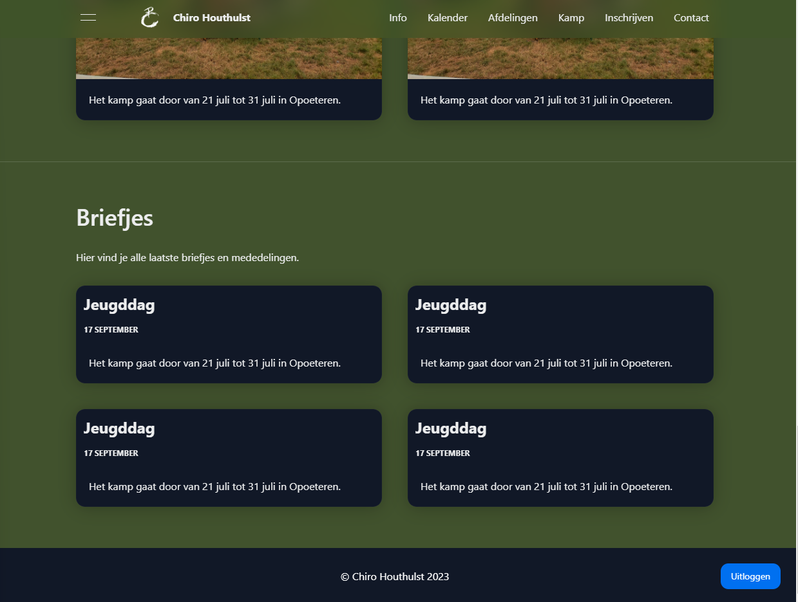
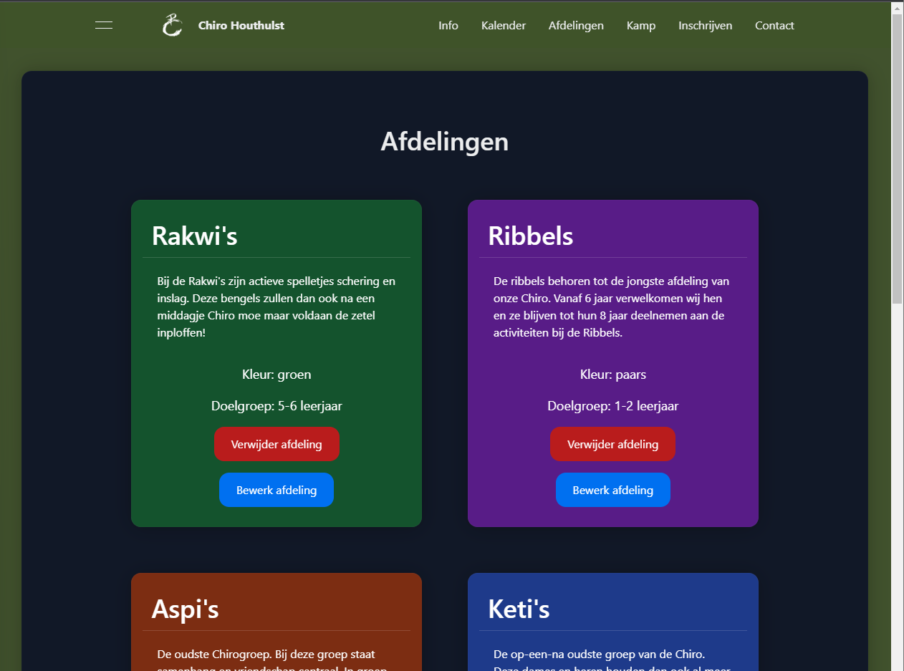
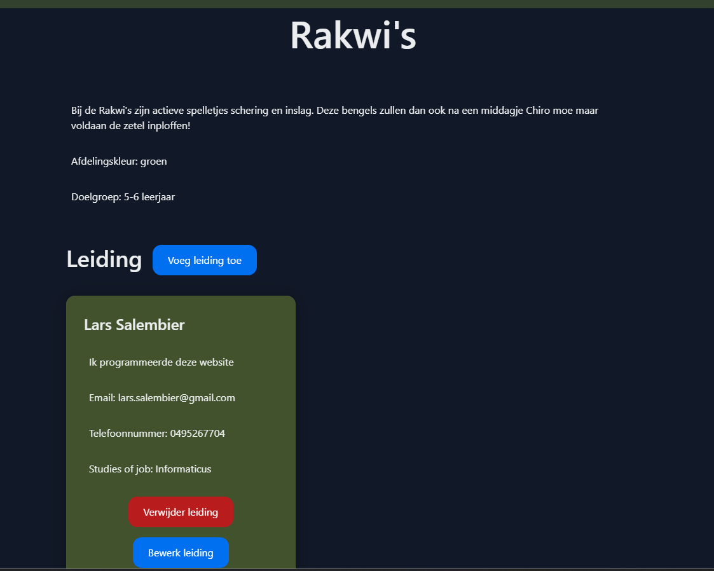
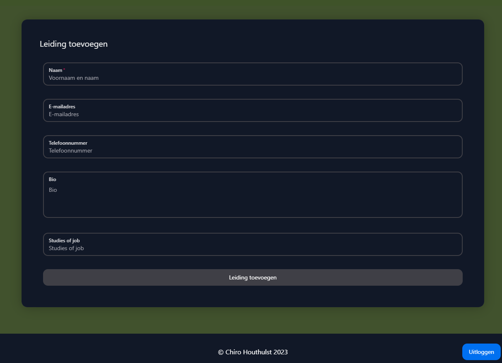
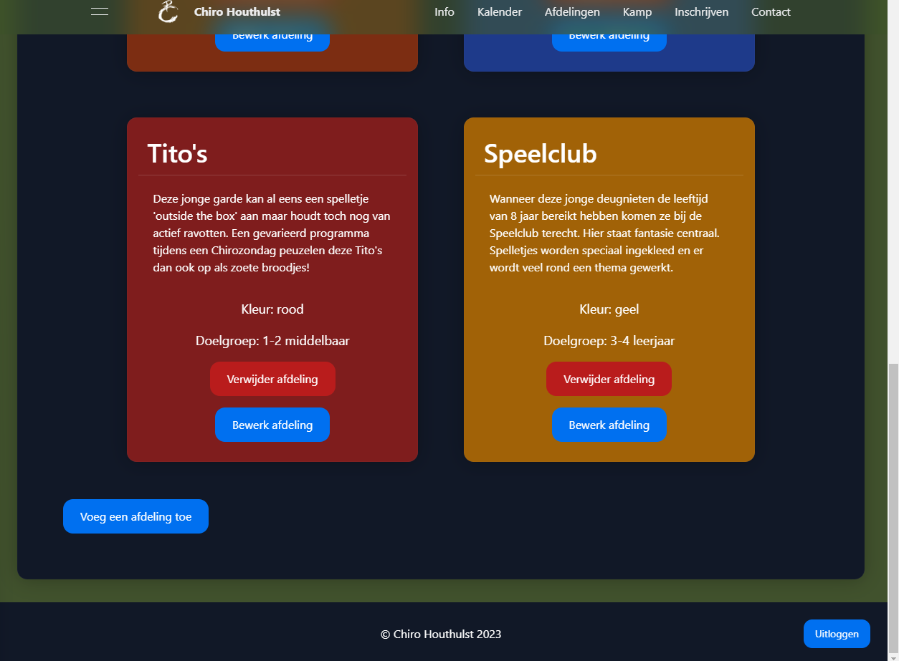
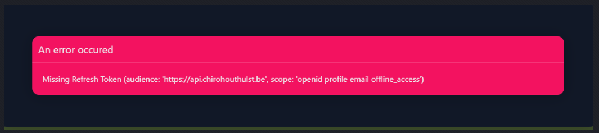

# Lars Salembier (202293794)

- [x] Front-end Web Development
  - [GitHub repository met commit history](https://github.com/LarsSalembier/2223-frontendweb-LarsSalembierV3)
  - [Github repository](https://github.com/Web-IV/2223-frontendweb-LarsSalembier)
  - [Online versie]() NIET VAN TOEPASSING
- [x] Web Services

  - [GitHub repository met commit history](https://github.com/LarsSalembier/2223-webservices-LarsSalembier-V2)
  - [Github repository](https://github.com/Web-IV/2223-webservices-LarsSalembier)
  - [Online versie]() NIET VAN TOEPASSING

  Ik ben opnieuw begonnen op een andere repo. Ik heb wel nog alles gepusht naar de classrooms, maar deze zijn dan zonder commit history. De commit history valt te bekijken op de andere repo's die ik hierboven heb gelinkt.

**Logingegevens**

- Gebruikersnaam/e-mailadres: admin123@gmail.com
- Wachtwoord: admin123@gmail.com

## Projectbeschrijving

Dit project is een (beginsel van) een website voor de lokale jeugdbeweging. Momenteel is enkel de homepage en de pagina 'Afdelingen' functioneel. Dit lijkt me echter meer dan voldoende voor de scope van deze opdracht (er zijn zeer veel verschillende routes, maar slechts 15 zijn effectief functioneel en geen boilerplate)

Aangezien het een website is voor een jeugdvereniging was het even zoeken naar de nood voor inlogsystemen. Er is een knop toegevoegd onderaan de homepage (in de footer) waarmee je kan inloggen. Als je ingelogd bent kan je vervolgens alle gegevens van de Afdelingen-pagina's aanpassen.

De databank voor dit project bestaat uit 3 tabellen:

- Administrator: deze tabel staat los van de andere en dient om accounts bij te houden
- Person: bevat alle personen die deel uitmaken van de verschillende afdelingen. Dit is geen User-systeem, deze personen kunnen door elke admin worden toegevoegd en zijn louter om de 'leidingsploeg' van elke afdeling mee te voorstellen.
- Group: bevat alle groepen waar personen deel van kunnen uitmaken. Sommige personen zijn lid van meerdere groepen, ...

Een vierde (tussen)tabel stelt de Memberships voor: de deelmaatschappen van personen aan groepen.

Dit zijn alle routes en hun toegelaten methodes op de backend. Ze worden lang niet allemaal gebruikt in de front-end, dit komt omdat ik eerst de backend schreef en dus nog niet volledig zeker was wat ik allemaal nodig zou hebben.

Routes en hun toegelaten methodes:

- /api/people
  - GET: geeft alle personen terug
  - POST: voegt een persoon toe
  - DELETE: verwijdert alle personen
- /api/people/:id
  - GET: geeft een persoon terug
  - PUT: wijzigt een persoon
  - DELETE: verwijdert een persoon
- /api/people/:id/groups
  - GET: geeft alle groepen van een persoon terug
  - POST: voegt een groep toe aan een persoon
  - DELETE: verwijdert alle groepen van een persoon
- /api/people/:id/groups/:id
  - DELETE: verwijdert een persoon uit een groep (maar verwijdert de groep niet)
- /api/groups
  - GET: geeft alle groepen terug
  - POST: voegt een groep toe
  - DELETE: verwijdert alle groepen
- /api/groups/:id
  - GET: geeft een groep terug
  - PUT: wijzigt een groep
  - DELETE: verwijdert een groep
- /api/groups/:id/members
  - GET: geeft alle leden van een groep terug
  - POST: voegt een lid toe aan een groep
  - DELETE: verwijdert alle leden van een groep
- /api/groups/:id/members/:id
  - DELETE: verwijdert een lid uit een groep (maar verwijdert die persoon niet)
- /api/administrators
  - GET: geeft alle administrators terug
  - POST: voegt een administrator toe
  - DELETE: verwijdert alle administrators
- /api/administrators/:id
  - GET: geeft een administrator terug
  - PUT: wijzigt een administrator
  - DELETE: verwijdert een administrator

Dit project begon als groot doel maar heb ik steeds in scope moeten verkleinen tijdens het beseffen wat voor werk het bouwen van zo'n groot project is. Maar ik plan alvast om er aan verder te werken en deze site ooit omhoog te kunnen gooien.

Ik koos voor Typescript omdat ik er veel positieve dingen over had gehoord en gelezen, maar jammergenoeg heeft Typescript ook zijn keerzijde. Bij de Front-End had ik enorme moeite met het toevoegen van testen, omdat mocking en typescript (in mijn ogen toch) echt aartsvijanden zijn van elkaar. Constante typeconflicten zorgden ervoor dat ik na een volledige dag proberen de testen aan de praat te krijgen het heb opgegeven.

Ik hoop dat jullie begrip hebben voor de situatie. Ik was bijna klaar met het project, en nu terug omswitchen naar JavaScript zou echt een enorm verlies van tijd en moeite geweest zijn.

## Screenshots

Dit is de (functieloze) hoofdstartpagina. De functionaliteit voor dit project ligt allemaal achter het `Afdelingen`-linkje in de navigatiebalk.

Onderaan de pagina vinden we de login- (en loguit-)knop om te kunnen beginnen met de website aanpassen.

We kunnen nu de afdelingen bewerken, verwijderen of verder de details bekijken

We gaan een detailpagina van de groep 'Rakwi's' bekijken. Hier kan je vervolgens leiding toevoegen, verwijderen of bewerken.

## Behaalde minimumvereisten

### Front-end Web Development

- **componenten**

  - [x] heeft meerdere componenten - dom & slim (naast login/register)
  - [x] definieert constanten (variabelen, functies en componenten) buiten de component
  - [x] minstens één form met validatie (naast login/register)
  - [x] login systeem (eigen of extern zoals bv. Auth0)  

- **routing**

  - [x] heeft minstens 2 pagina's (naast login/register)
  - [x] routes worden afgeschermd met authenticatie en autorisatie  

- **state-management**

  - [x] meerdere API calls (naast login/register)
  - [x] degelijke foutmeldingen indien API call faalt
  - [x] gebruikt `useState` enkel voor lokale state
  - [x] gebruikt `Context`, `useReducer`, `Redux`… voor globale state  

- **hooks**

  - [x] kent het verschil tussen de hooks (`useCallback`, `useEffect`…)
  - [x] gebruikt de hooks op de juiste manier  

- **varia**
  - [ ] een aantal niet-triviale testen (unit- en/of end-to-end- en/of UI-testen) (Zie projectbeschrijving en `README.md` voor reden tot geen testen)
  - [x] minstens één extra technologie
  - [x] duidelijke en volledige `README.md`
  - [x] volledig en tijdig ingediend dossier

### Web Services

- **datalaag**

  - [x] voldoende complex (meer dan één tabel)
  - [x] één module beheert de connectie + connectie wordt gesloten bij sluiten server
  - [x] heeft migraties
  - [x] heeft seeds  

- **repositorylaag**

  - [x] definieert één repository per entiteit (niet voor tussentabellen) - indien van toepassing
  - [x] mapt OO-rijke data naar relationele tabellen en vice versa  

- **servicelaag met een zekere complexiteit**

  - [x] bevat alle domeinlogica
  - [x] bevat geen SQL-queries of databank-gerelateerde code  

- **REST-laag**

  - [x] meerdere routes met invoervalidatie
  - [x] degelijke foutboodschappen
  - [x] volgt de conventies van een RESTful API
  - [x] bevat geen domeinlogica
  - [x] degelijke authorisatie/authenticatie op alle routes  

- **varia**
  - [x] een aantal niet-triviale testen (min. 1 controller >=80% coverage)
  - [x] minstens één extra technologie
  - [x] duidelijke en volledige `README.md`
  - [x] maakt gebruik van de laatste ES6-features (object destructuring, spread operator...)
  - [x] volledig en tijdig ingediend dossier

## Projectstructuur

### Front-end Web Development

De api-hooks zitten in een mapje `api`, de verschillende pagina's hebben ofwel 1 bestand ofwel een mapje met de naam van de pagina in de map `pages`, en enkele triviale componenten zitten in `components`. De componenten die slechts op een enkele pagina gebruikt worden zitten in het mapje van de pagina.

### Web Services

Alle databankgerelateerde data zit in het mapje `prisma` (inclusief gegenereerde migraties (dit doet Prisma voor jou)). Hier vind je ook het `schema.prisma`-bestand terug, waarin de structuur van de databank gedefinieerd staat.

In `src` vinden we vervolgens volgende items terug:

- `core`: bevat de hoofdcomponenten van het programma
  - `Auth.ts`: bevat alle authenticatie-gerelateerde code
  - `CorsManager.ts`: bevat alle code die de CORS-instellingen beheert
  - `CustomLogger.ts`: bevat geconfigureerde `winston`-logger.
  - `CustomPrismaClient.ts`: bevat een geconfigureerde `PrismaClient`
  - `ErrorHandler.ts`: bevat een errorhandler die de errors opvangt en een duidelijke boodschap teruggeeft
  - `RequestLogger.ts`: bevat een logger die alle requests logt
  - `Server.ts`: bevat de server, het hoofdcomponent van het programma. Deze klasse configureert alles en bevat een `start`- en `stop`-methode.
- `repository`: bevat alle repositories en gerelateerde klassen
- `router`: bevat alle routers en gerelateerde klassen
- `service`: bevat alle services en gerelateerde klassen
- `seeders`: bevat alle seeders en gerelateerde klassen
- `validation`: bevat alle validatieschema's en gerelateerde klassen
- `index.ts`: startpunt van de applicatie. Bouwt een server en start deze (en sluit deze ook weer af bij het stoppen van de applicatie).

## Extra technologie

### Front-end Web Development

#### Typescript

De website is volledig geschreven in [Typescript](https://www.npmjs.com/package/typescript). TypeScript is een opensource-programmeertaal die JavaScript uitbreidt met statische types. Dit maakt het mogelijk om fouten op te sporen tijdens het ontwikkelingsproces in plaats van tijdens de uitvoering. Hierdoor kan de code efficiënter en betrouwbaarder worden ontwikkeld.

#### Vite

De website wordt gebuild met [Vite](https://www.npmjs.com/package/vite) in plaats van Create-React-App (CRA). Vite is een frontend build tool die véél sneller is dan CRA. De opstart- en recompiletijden van Vite-applicaties zijn zéér kort.

#### Speedy Web Compiler (SWC)

Vite is geconfigureerd om [SWC](https://swc.rs/) te gebruiken in plaats van de standaard Typescript compiler Babel. SWC is een supersnelle Typescript compiler die 20 tot 70 keer sneller is dan Babel.

#### ESLint en Prettier

Tijdens development gebruiken we de linting tool [ESLint](https://www.npmjs.com/package/eslint). ESLint zal problemen in de code vroegtijdig aanduiden. We gebruiken hierbovenop de opinionated codeformatter [Prettier](https://www.npmjs.com/package/prettier) om extra code styling toe te voegen.

##### ESLint Configuraties

We gebruiken hierbij [eslint-config-airbnb](https://www.npmjs.com/package/eslint-config-airbnb) als basisconfiguratie. Deze opinionated style guide voor React-projecten ontwikkeld door Airbnb is zeer populair en zorgt voor uniforme code practices doorheen het hele project.

- We breiden deze style guide uit voor gebruik met Typescript via de plugin [eslint-config-airbnb-typescript](https://www.npmjs.com/package/eslint-config-airbnb-typescript)

Hierbovenop gebruiken we [eslint-config-prettier](https://www.npmjs.com/package/eslint-config-prettier) om de Prettier-stijlregels toe te passen.

##### ESLint Plugins

We gebruiken ook enkele plugins die ESLint uitbreiden voor gebruik met:

- `import`/`export` syntax:
  [eslint-plugin-import](https://www.npmjs.com/package/eslint-plugin-import)
- React: [eslint-plugin-react](https://www.npmjs.com/package/eslint-plugin-react)
  - Hooks: [eslint-plugin-react-hooks](https://www.npmjs.com/package/eslint-plugin-react-hooks)
  - JSX: [eslint-plugin-jsx-a11y](https://www.npmjs.com/package/eslint-plugin-jsx-a11y)
- Typescript:
  - [@typescript-eslint/eslint-plugin](https://www.npmjs.com/package/@typescript-eslint/eslint-plugin)
  - [@typescript-eslint/parser](https://www.npmjs.com/package/@typescript-eslint/parser)
- Prettier: [eslint-plugin-prettier](https://www.npmjs.com/package/eslint-plugin-prettier)

#### NextUI

We gebruiken [NextUI](https://www.npmjs.com/package/@nextui-org/react) als UI-framework. NextUI is een React UI-framework gebaseerd op TailwindCSS en Framer Motion.

#### Framer Motion

We gebruiken [Framer Motion](https://www.npmjs.com/package/framer-motion) om animaties toe te voegen aan onze website. Framer Motion is een React library voor het maken van animaties.

#### TailwindCSS

We gebruiken [TailwindCSS](https://www.npmjs.com/package/tailwindcss) als CSS-framework. TailwindCSS is een utility-first CSS-framework. Dit betekent dat het geen kant-en-klare componenten bevat zoals Bootstrap, maar dat je zelf de componenten moet bouwen. We gebruiken TailwindCSS omdat het een zeer lichtgewicht framework is en omdat het zeer flexibel is. TailwindCSS is ook zeer populair en heeft een grote community.

We gebruiken [prettier-plugin-tailwindcss](https://www.npmjs.com/package/prettier-plugin-tailwind) om TailwindCSS classes te formatteren en ordenen met Prettier.

We gebruiken [PostCSS](https://www.npmjs.com/package/postcss) om TailwindCSS te compileren naar CSS. PostCSS is een tool voor het transformeren en optimaliseren van CSS met JavaScript.

We gebruiken [Autoprefixer](https://www.npmjs.com/package/autoprefixer) om vendor prefixes toe te voegen aan onze CSS. Dit zorgt ervoor dat onze CSS-code compatibel is met alle browsers.

We gebruiken [PostCSS-import](https://www.npmjs.com/package/postcss-import) om CSS-bestanden te importeren in andere CSS-bestanden.

We gebruiken [PostCSS-nested](https://www.npmjs.com/package/postcss-nested) om geneste CSS te schrijven.

### Web Services

#### Typescript

[Typescript](https://www.npmjs.com/package/typescript) is een superset van Javascript die Javascript type-safe maakt. Ik heb hiervoor gekozen omdat ik bij de vorige poging code had met heel veel errors die konden vermeden worden als ik binnen type-constraints zou moeten blijven.

#### Prisma

[Prisma](https://www.npmjs.com/package/prisma) is een ORM die het mogelijk maakt om een databank te beheren zonder SQL te moeten schrijven. Ik heb hiervoor gekozen omdat ik deze technologie wou leren. Ik vind dat het een heel krachtige tool is die het mogelijk maakt om heel snel een databank op te zetten en te beheren. De gegenereerde migraties en types hebben de ontwikkeling van de applicatie ook heel wat versneld.

#### ESLint

[ESLint](https://www.npmjs.com/package/eslint/) is een linter die je code analyseert en je waarschuwt voor mogelijke fouten.

Ik heb de configuratie van Airbnb ([eslint-config-airbnb-base-typescript-prettier](https://www.npmjs.com/package/eslint-config-airbnb-base-typescript-prettier)) gebruikt hierbij omdat deze zeer populair leek en de regels die deze gebruikt mij ook wel aanstonden. Daarnaast heb ik ook nog een aantal regels toegevoegd die ik zelf belangrijk vond.

#### Prettier

[Prettier](https://www.npmjs.com/package/prettier) is een formatter die je code formatteert volgens een bepaalde stijl.

Ik vind het belangrijk dat de code die ik schrijf er consistent uitziet en dat ik niet moet nadenken over hoe ik mijn code moet formatteren. Daarom heb ik ervoor gekozen om Prettier te gebruiken. Samen met de VSCode-extensie [Prettier - Code formatter](https://marketplace.visualstudio.com/items?itemName=esbenp.prettier-vscode) was deze tool zeer handig.

#### Vitest

[Vitest](https://www.npmjs.com/package/vitest) is een testrunner die specifiek gemaakt is voor Typescript en sneller is dan Jest.

Voor de frontent heb ik Vite gebruikt en ik wou ook graag een testrunner die hiermee compatibel was. Omdat ik toch al deze testrunner kende, heb ik deze ook gebruikt voor de backend.

Wanneer je de tests draait, zal je merken dat er 246 integratietests zijn. Deze tests zijn zeer snel uitgevoerd dankzij Vitest.

#### Faker.js

[Faker.js](https://www.npmjs.com/package/@faker-js/faker) is een library die je toelaat om fake data te genereren.

Voor de testen en voor de seeders heb ik deze library gebruikt om fake data te genereren. Zo moest ik niet al te veel tijd spenderen aan het genereren van deze data. Daarbovenop is de data die gegenereerd wordt ook nog eens zeer realistisch.

## Testresultaten

### Front-end Web Development

Jammergenoeg zijn er geen tests te bespeuren in de Front-End. Doordat ik de (achteraf gezien niet zo slimme) keuze gemaakt heb om Typescript te gebruiken voor de tweede iteratie van dit project, en het feit dat mocking daardoor vrijwel onmogelijk / zeer moeilijk wordt. Zelfs opzetten van een Cypress custom commando (voor de authenticatie) bleek niet mogelijk. Na vele uren hiermee met de handen in het haar te zitten heb ik het schrijven van testen bij dit project opgegeven. Ik heb nog geprobeerd om unit tests te schrijven, maar ook hier is er nood aan mocking en dit is zeer ingewikkeld. Bovendien is mocking met Jest niet geondersteund in combinatie met ESM en werkt het mocken van modules momenteel niet. Met Typescript er nog eens bij gemoeid was het te veel.

Ter vergelijking, bij Web Services heb ik in 260 integratietests geschreven. Het is echt gewoon te ingewikkeld en slecht gedocumenteerd om het verder te zetten. Nu nog terugkeren naar JavaScript zou ook enorm zonde zijn.

### Web Services

Er zijn 246 integratietesten geschreven over alle routes. Alle testen slagen.

Na het draaien van `yarn test:coverage` krijg je volgende resultaten:

Je ziet dat er een algemene test coverage is van 78%.

De meeste bestanden zitten boven de 80% coverage. Er zijn echter enkele uitzonderingen:

- de seeders: voor seeding heb ik geen testen geschreven.
- `Auth.ts`: de authenticatiecode zelf wordt weinig tot niet getest.

Hopelijk kunnen mijn tests voor web services mijn tests voor front-end compenseren, ik heb enorm veel moeite gestopt in dit project en het zou jammer zijn dat dat allemaal voor niks zou zijn.

## Gekende bugs

### Front-end Web Development

Wanneer men niet is ingelogd, is het de bedoeling dat alle edit- en create-knoppen verdwijnen. In de plaats daarvan geeft auth0 deze cryptische error die na wat research en vele uren debuggen er niet uit raakt.

### Web Services

Geen gekende bugs.
